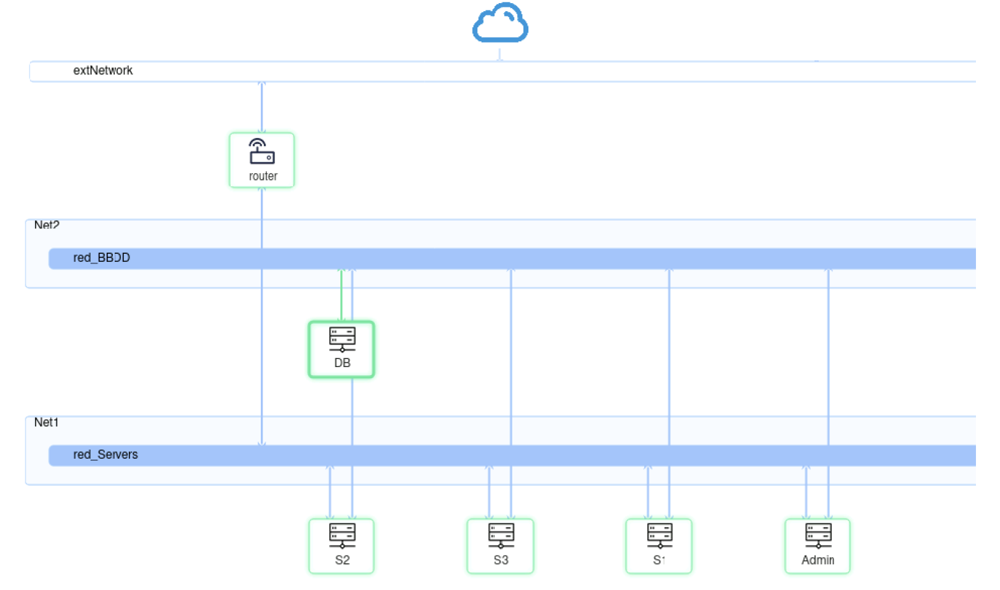

# CNVR - Computación en Nube y Virtualización de Redes y Servicios

## Descripción del Proyecto
Este proyecto forma parte del curso 2024-25 y tiene como objetivo el despliegue automático de una aplicación escalable en una nube OpenStack utilizando los servicios de orquestación de Terraform. La aplicación está compuesta por servidores web, una base de datos, balanceadores de carga y un firewall, todos gestionados de manera automatizada. El escenario Opnestack utilizado es el mostrado a continuación.


## Características Principales
- **Automatización** del despliegue mediante scripts y plantillas de Terraform.
- **Infraestructura escalable** con tres servidores web iniciales, con posibilidad de añadir más dinámicamente.
- **Base de datos accesible** desde los servidores web.
- **Firewall** para gestionar el acceso desde el exterior.
- **Balanceador de carga** utilizando Octavia LBaaS o HAProxy.
- **Accesibilidad segura** mediante una máquina de administración con acceso SSH restringido.

## Arquitectura del Proyecto
El entorno se compone de los siguientes elementos segun la arquitecura de la siguiente imágen:
- **Servidores Web (s1, s2, s3)**: Alojamiento de la aplicación web.
- **Base de Datos (BBDD)**: Almacén de datos de la aplicación.
- **Servidor de Administración**: Gestión y mantenimiento del servicio (SSH restringido).
- **Firewall**: Filtrado de accesos desde el exterior.
- **Balanceador de Carga**: Distribución del tráfico entre los servidores web.



## Requisitos
Para desplegar el entorno correctamente, es necesario:
- **OpenStack** configurado y accesible.
- **Terraform** instalado.
- **Conocimiento de cloud-init** para la configuración automática de las instancias.
- **Acceso a una imagen de Ubuntu** compatible con cloud-init.

## Instalación y Despliegue
1. **Clonar el repositorio:**
   ```sh
   git clone https://github.com/mcostama25/CNVR.git
   cd CNVR
   ```
2. **Configurar credenciales de OpenStack:**
   ```sh
   source openstack-credentials.sh
   ```
3. **Inicializar y aplicar Terraform:**
   ```sh
   terraform init
   terraform apply -auto-approve
   ```
4. **Verificar el despliegue:**
   - Listar las instancias creadas en OpenStack.
   - Comprobar la conectividad con los servidores web y la base de datos.

## Uso
- Para acceder al servidor de administración:
  ```sh
  ssh -p 2022 usuario@<IP_ADMIN>
  ```
- Para verificar el balanceador de carga:
  ```sh
  curl http://<IP_BALANCEADOR>
  ```
- Para escalar el servicio agregando más servidores:
  ```sh
  terraform apply -var 'num_servidores=4'
  ```
rónico.

